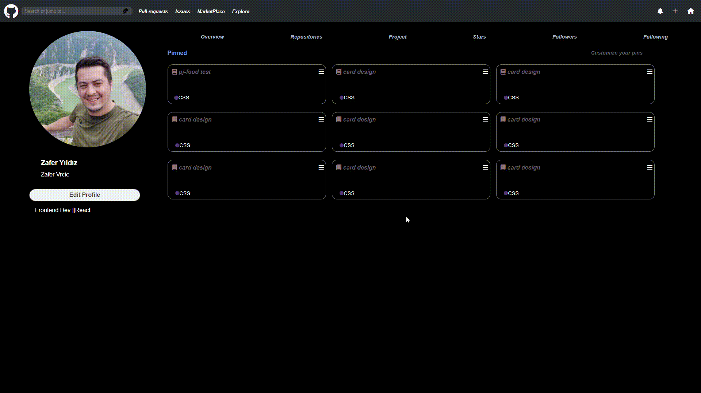

<h1>Git-pj</h1>

Actually basic git project to work a little on parent child connection and open for manipulating.
can continue and boost more and more 

<h2>Techs<h2>
-HTML
-HTML5
-CSS
-CSS3
-SCSS

<h1>Libraries</h1>

Icons and fonts: <link
      rel="stylesheet"
      href="https://cdnjs.cloudflare.com/ajax/libs/font-awesome/6.4.2/css/all.min.css"
    />
    <link rel="preconnect" href="https://fonts.googleapis.com" />
    <link rel="stylesheet" href="style.css" />r"
    />

<h1>Project Gif</h1>

<!--  -->
